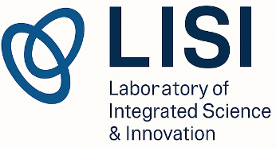

<!DOCTYPE html>
<html lang="pt-BR">
<head>
  <meta charset="UTF-8" />
  <meta name="viewport" content="width=device-width, initial-scale=1.0" />
  <title>L.I.S.I. – Laboratory of Integrated Science & Innovation</title>
  
</head>
<body>
  <header>
    
    <h1>Bem-vindo ao L.I.S.I.</h1>
  </header>

  <main>
    

      O <strong>L.I.S.I. – Laboratório de Ciência Integrada & Inovação</strong> é um laboratório aberto, interdisciplinar e internacional dedicado à pesquisa, desenvolvimento e inovação nas áreas de Inteligência Artificial, Computação Quântica, Ética Digital e Educação Científica.
    

    

      Nosso propósito é promover soluções tecnológicas éticas e de impacto social, integrando ciência, tecnologia e governança para um futuro cognitivo e colaborativo.
    

    <a href="https://forms.gle/https://forms.gle/NtqNs9W" class="btn">Clique aqui para se inscrever no L.I.S.I.</a>
  </main>
</body>
</html>
